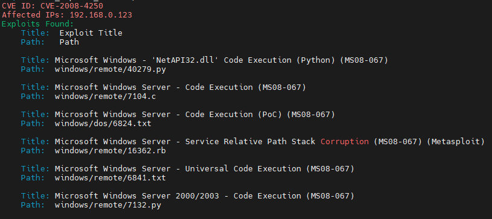

# Proxy Chains

Sometimes we need to remain untraceable while performing a pentest activity. Proxychains helps us by allowing us to use an intermediary system whose IP can be left in the logs of the system without the worry of it tracing back to us.

Proxychains is a tool that allows any application to follow connection via proxy such as SOCKS5, Tor, and so on.

```
vim /etc/proxychains.conf
```

We can add all the proxies we want in the preceding highlighted area and then save.



uncomment “strict\_chain”

Create your tunnel:

```
ssh -D 1234 user@host
```

example proxy chains:

socks4 127.0.0.1 9050\
socks5 127.0.0.1 9050\
****socks5 127.0.0.1 1234


\


