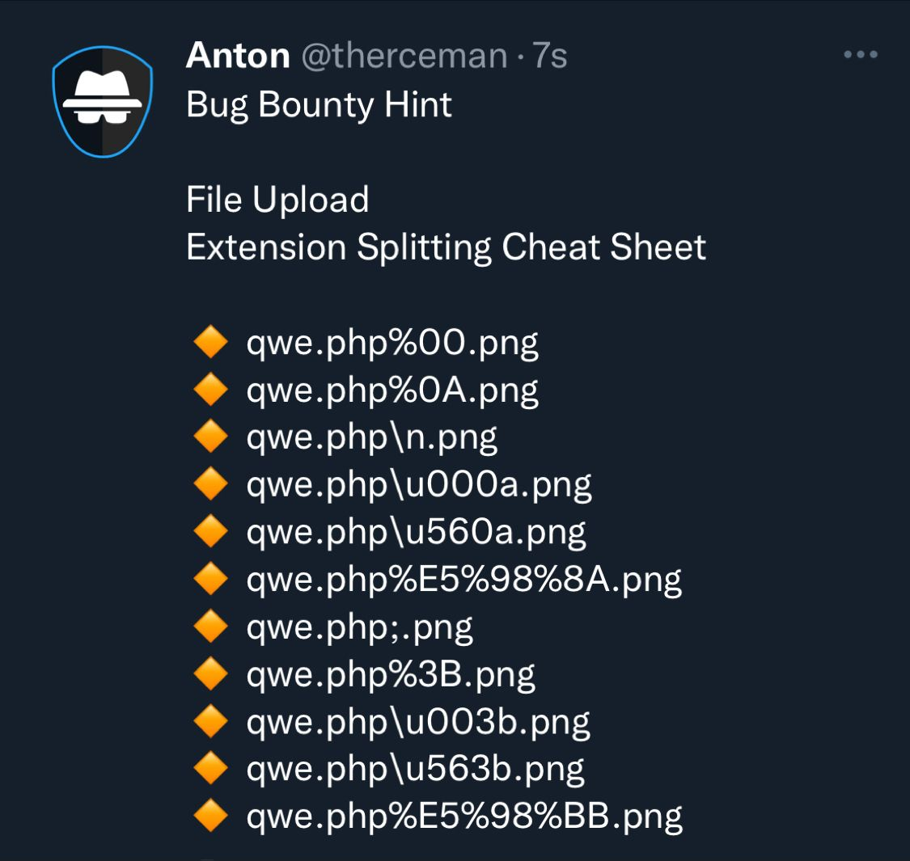

# Uploads

## What is an Upload Vulnerability?

Upload vulnerabilities occur when an application does not properly validate or sanitize user-uploaded files. This can lead to unauthorized code execution, file inclusion, or other security breaches. Attackers may exploit these vulnerabilities to upload malicious files, such as web shells or configuration files, that can compromise the server or application.

### Example Tests for Upload Vulnerabilities

When performing a penetration test, you can use various payloads to test for upload vulnerabilities. Below are some example tests and methodologies to identify such vulnerabilities.

### **Example Payloads and Techniques**

1. **Uploading a Web Shell**
   *   **PHP Web Shell**: Upload a simple PHP file with the following content:

       ```php
       <?php system($_GET['cmd']); ?>
       ```
   *   **ASP Web Shell**: Upload an ASP file with the following content:

       
       ```aspnet
       <% @Page Language="C#" %>
       <script runat="server">
       void Page_Load(object sender, EventArgs e) {
           if (Request.QueryString["cmd"] != null) {
               System.Diagnostics.Process.Start("cmd.exe", "/c " + Request.QueryString["cmd"]);
           }
       }
       </script>
       ```
       
2.  **Uploading .htaccess File**

    *   To change the behaviour of the web server, you can upload an `.htaccess` file:

        ```bash
        AddType application/x-httpd-php .jpg
        ```

    This allows you to upload a PHP file disguised with a `.jpg` extension and have it executed as PHP.
3. **Bypassing File Type Restrictions**
   * **Polyglot Files**: Create a file that can be interpreted as both an image and a script. For example, an image with PHP code hidden in comments.
   * **MIME Type Bypass**: Change the MIME type of the file to bypass content-type checks.
4. **Using Alternate Extensions**
   * Upload files with different extensions that might still be interpreted as scripts by the server, such as `.phtml`, `.phar`, or `.shtml`.
5. **Configuration Files**
   * **Apache Configuration (.htaccess)**: Upload an `.htaccess` file to enable execution of other uploaded files.
   * **Tomcat Configuration**: Modify the `web.xml` file to include malicious servlet mappings.

## Testing Methodology

1. **Identify Upload Points**:
   * Locate file upload functionalities in the application, such as profile picture uploads, document uploads, etc.
2. **Attempt File Uploads**:
   * Use various payloads to attempt uploading different file types and observe the server's response.
   * Monitor the server's directory structure to see where files are stored and if they are accessible.
3. **Analyze Responses**:
   * Check if the uploaded files are executable by accessing them directly via a web browser.
   * Use intercepting proxies like Burp Suite or OWASP ZAP to manipulate file uploads and bypass client-side restrictions.
4. **Monitor Server Behavior**:
   * Observe any changes in server behaviour, error messages, or execution of uploaded files.

### References

* [PayloadsAllTheThings - Upload Insecure Files](https://github.com/swisskyrepo/PayloadsAllTheThings/blob/master/Upload%20Insecure%20Files/README.md)
* [PayloadsAllTheThings - Jetty RCE](https://github.com/swisskyrepo/PayloadsAllTheThings/blob/master/Upload%20Insecure%20Files/Jetty%20RCE/JettyShell.xml)
* [PayloadsAllTheThings - Extension ASP](https://github.com/swisskyrepo/PayloadsAllTheThings/blob/master/Upload%20Insecure%20Files/Extension%20ASP/shell.aspx)

### Example bypass upload restrictions.&#x20;

<figure><figcaption></figcaption></figure>

## Antivirus testing / sanitisation of files

Antivirus testing and file sanitization are crucial steps to ensure that uploaded files do not contain malicious content. By integrating antivirus solutions and file sanitization processes, you can prevent the upload of harmful files that could compromise your system.

### **EICAR Test Files**

EICAR (European Institute for Computer Antivirus Research) provides standard test files that can be used to test the effectiveness of antivirus software. These files are harmless and are designed to trigger antivirus alerts.

To test your antivirus and file sanitisation mechanisms, you can use a ZIP file containing EICAR test files. The ZIP file is password-protected to prevent accidental execution. The password for the ZIP file is "password".

**Download the ZIP file containing EICAR test files**:



#### **Contents of the ZIP file**:

1. **eicar.com**: A standard EICAR test file.
2. **eicar (copy 1).txt**: A copy of the EICAR test file with a different name.
3. **eicar.exe**: The EICAR test file with an `.exe` extension.
4. **eicarfileupload.png**: A PNG image containing the EICAR test string.
5. **eicarfileupload.png\_original**: The original PNG image.
6. **eicar.jpeg**: The EICAR test file with a `.jpeg` extension.
7. **eicar.pdf**: The EICAR test file with a `.pdf` extension.
8. **eicar.perl**: The EICAR test file with a `.perl` extension.
9. **eicar.png**: The EICAR test file with a `.png` extension.
10. **eicar.py**: The EICAR test file with a `.py` extension.
11. **eicar.tar.gz**: The EICAR test file compressed in a `.tar.gz` archive.
12. **eicar.txt**: The standard EICAR test file in a `.txt` format.

#### **Example Tests**

1. **Upload the ZIP File**:
   * Upload the EICAR ZIP file to the application.
   * Check if the antivirus detects and blocks the upload.
2. **Extract and Scan**:
   * If the file is uploaded successfully, the server should extract the contents of the ZIP file.
   * The antivirus should scan the extracted files and block or quarantine any malicious content.
3. **Sanitization Process**:
   * Implement a sanitization process to clean or remove any detected threats.
   * Ensure the application notifies the user if their upload contained malicious content and was sanitized.

### Testing Methodology

1. **Identify Upload Points**:
   * Locate file upload functionalities in the application, such as profile picture uploads, document uploads, etc.
2. **Attempt File Uploads**:
   * Use various payloads to attempt uploading different file types and observe the server's response.
   * Monitor the server's directory structure to see where files are stored and if they are accessible.
3. **Analyse Responses**:
   * Check if the uploaded files are executable by accessing them directly via a web browser.
   * Use intercepting proxies like Burp Suite or OWASP ZAP to manipulate file uploads and bypass client-side restrictions.
4. **Monitor Server Behaviour**:
   * Observe any changes in server behaviour, error messages, or execution of uploaded files.

#### Conclusion

Upload vulnerabilities can lead to severe security breaches if not properly mitigated. Always ensure user inputs are sanitised and validated before processing. Implement proper file type checks, size limits, and use safe directories for storing uploaded files. Regular security testing and updates to the application code can help prevent such vulnerabilities.
